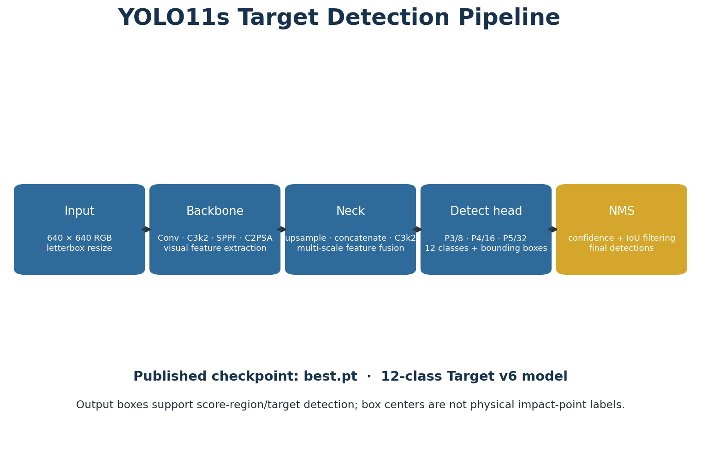
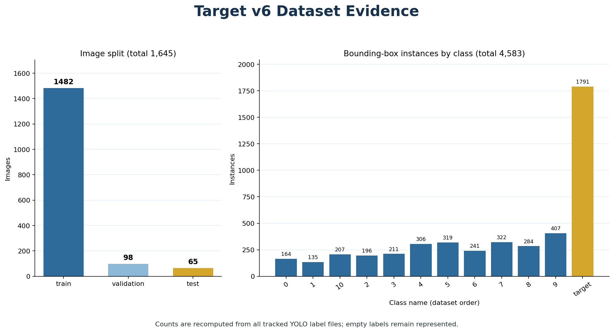
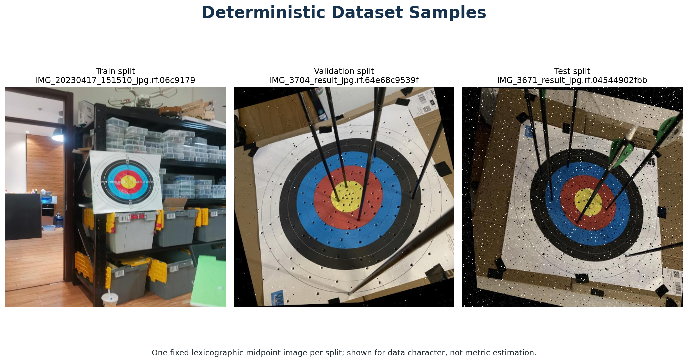
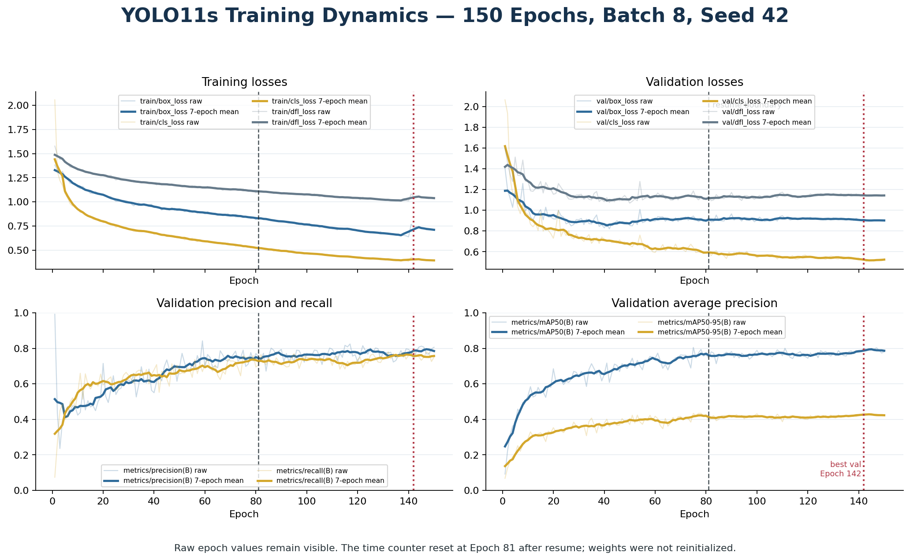
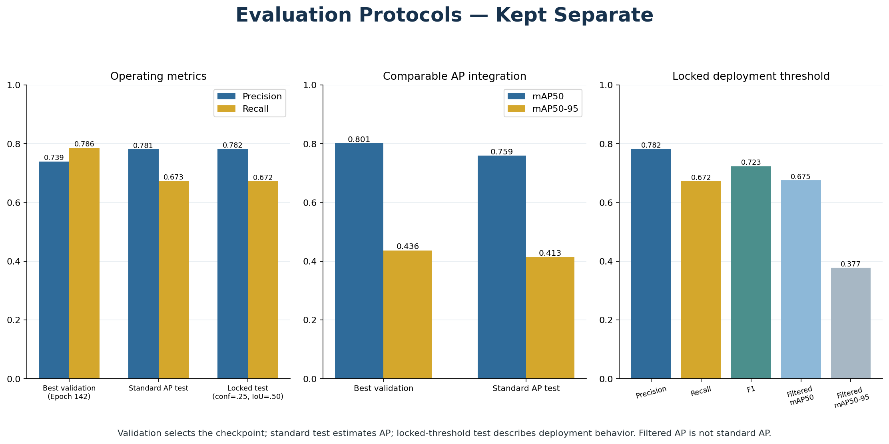
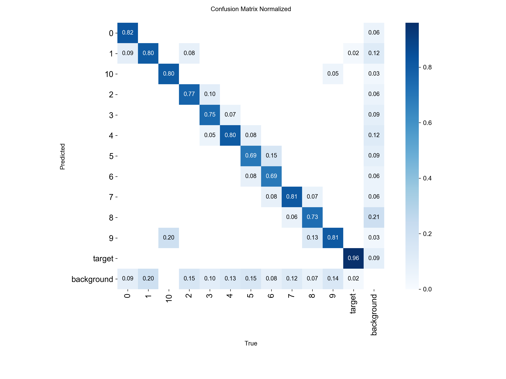
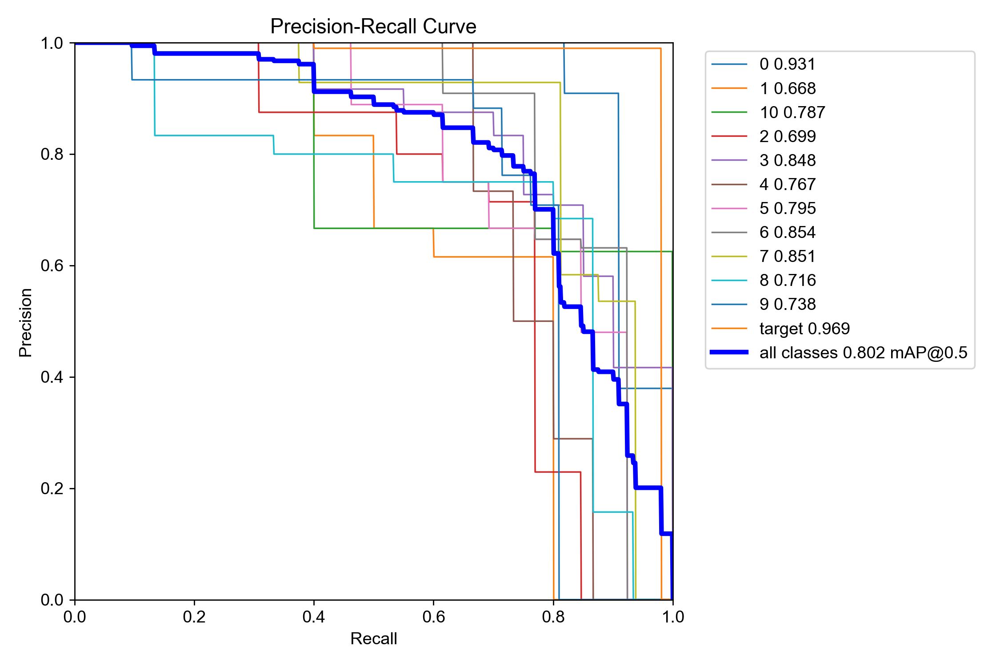
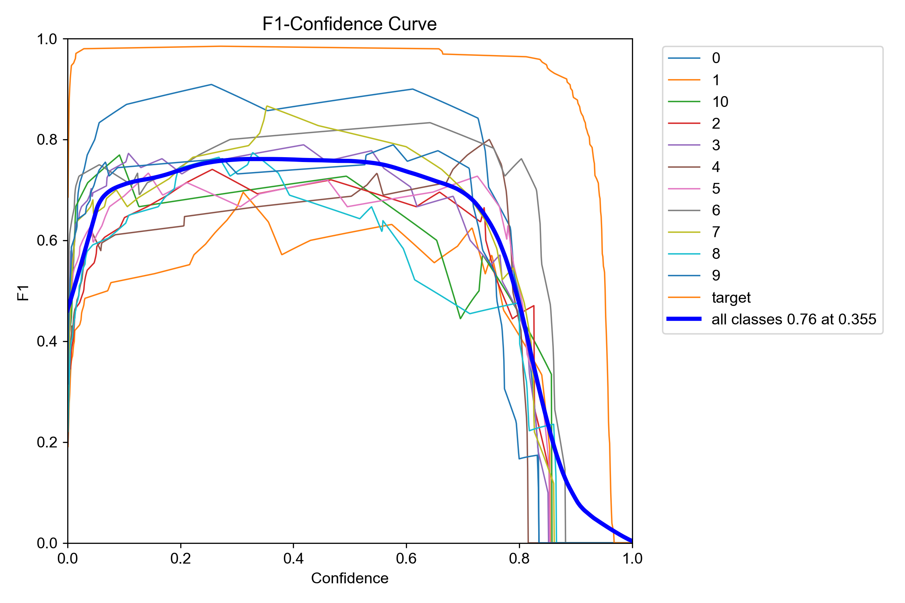
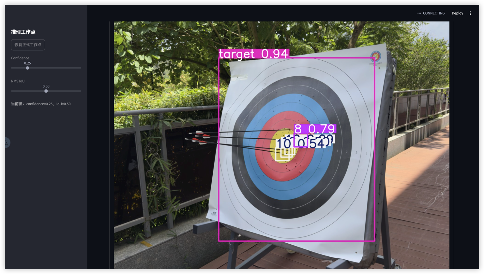

# Visual Evidence and Interpretation

[简体中文](VISUAL_ANALYSIS.zh-CN.md) · [Back to README](README.md)

This page connects every repository visualization to the tracked dataset, the 150-row training log, protocol-separated evaluation JSON, or the authors' local inference interface. The figures are generated by `scripts/generate_repository_visuals.py`; their machine-readable source tables and hashes are stored in `evaluation/visualization_sources/`.

## 1. Model implementation



An input image is letterboxed to \(640\times640\). The backbone extracts increasingly semantic features, the neck fuses high-resolution detail with deep context, and the detect head predicts 12 classes and bounding boxes at three scales. NMS then removes competing boxes according to confidence and IoU. This pipeline is instantiated by the repository's `best.pt`; it is a Target v6 reproduction, not the Roboflow author's checkpoint. A predicted score position is a **bounding-box center, not physical impact** ground truth.

## 2. Dataset composition



The tracked Target v6 release contains 1,645 image-label pairs: 1,482 train, 98 validation and 65 independent test images. All 4,583 box instances are recomputed directly from YOLO labels. The `target` class has 1,791 instances, while score-region classes range from 135 to 407, so class imbalance is a real limitation.



The montage uses one deterministic image from each split to show the source domain. It is descriptive only: it does not estimate accuracy and does not prove that the splits are capture-session independent.

## 3. Training dynamics



The detector was trained for 150 epochs with batch 8, seed 42 and input size 640. Thin lines are the raw logged values; thick lines are clearly labelled 7-epoch moving means used only for legibility. Training losses keep declining, while validation mAP50–95 reaches its maximum of 0.43646 at **Epoch 142**. The dashed Epoch 81 line marks the resume boundary: the `time` counter restarted, but model and optimizer states were restored rather than reinitialized.

The curves support convergence, but do not by themselves establish generalization. Checkpoint selection used validation; the independent test split was evaluated separately.

## 4. Validation versus independent test



The three columns answer different questions:

- **Best validation:** selects `best.pt` at Epoch 142; Precision 0.7394, Recall 0.7858, mAP50 0.8012 and mAP50–95 0.4365.
- **Standard AP test:** integrates predictions on all 65 test images with confidence floor 0.001 and NMS IoU 0.70; Precision 0.7811, Recall 0.6727, mAP50 0.7590 and mAP50–95 0.4131.
- **Locked operating-point test:** evaluates deployment behavior at `confidence=0.25` and `NMS IoU=0.50`; Precision 0.7816, Recall 0.6723 and F1 0.7229. Its confidence-filtered AP values are shown in a separate panel and must not be renamed standard AP.

The lower test Recall and mAP indicate a measurable validation-to-test gap. Possible drivers include the small 65-image test set, class imbalance, heterogeneous capture conditions, and visually related samples across public splits. Those are evidence-backed risks, not a claim that one specific cause has been proven.

## 5. Class-level diagnostics







These Ultralytics artifacts show which classes are confused and how precision, recall and F1 vary with confidence. They complement the aggregate numbers, but threshold curves derived from validation must not be presented as new independent-test estimates.

## 6. Real local-model inference



**Provenance:** real local inference run by Zhengyang Wang using this repository's `models/yolo11s-target-v6/best.pt`. The Streamlit controls show `confidence=0.25` and `NMS IoU=0.50`. The large magenta `target 0.94` box is the full-target detection with confidence 0.94; `8 0.79` is one score-region prediction with confidence 0.79.

This is a **qualitative** field case, not a replacement for the 65-image independent test. It shows that the model can find the full target under perspective, outdoor lighting and background clutter. It also exposes a dense overlap limitation: several white score boxes and labels overlap near the centre, reducing readability and making small-region localization harder to inspect. The displayed locations are predicted bounding-box centers and are **not physical impact** annotations or official competition scores.

## Reproduce the figures

```bash
PYTHONPATH=src:. python3 scripts/generate_repository_visuals.py --root .
```

The local inference screenshot is intentionally not regenerated by CI because it is qualitative author-provided evidence. Quantitative figure sources remain reproducible from tracked files.
